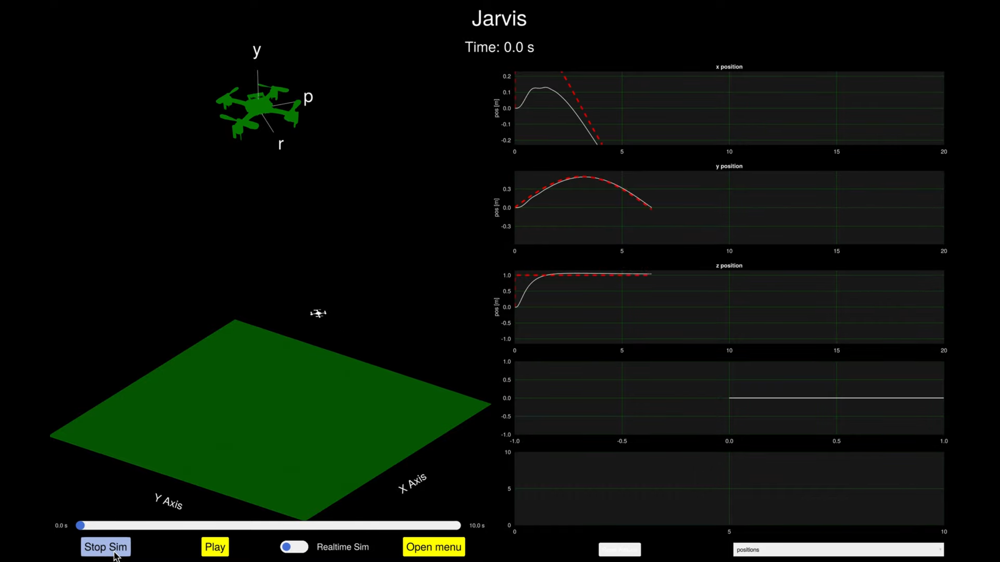

FlyingRobots is a project focused on the simulation and control of quadcopters. It utilizes mathematical modeling to predict and analyze the behavior of these aerial vehicles under various conditions.



## Installation
To set up the FlyingRobots project, follow these steps:
1. Ensure you have Julia installed on your system. Visit https://julialang.org/downloads/ for instructions.

2. Clone the repository to your local machine:
   ```
   git clone https://github.com/your-repository/FlyingRobots.git
   ```

## Usage
To try the 3d quadcopter example, run the following command in the Julia REPL:

```julia
include("examples/quad_3d.jl")
```
